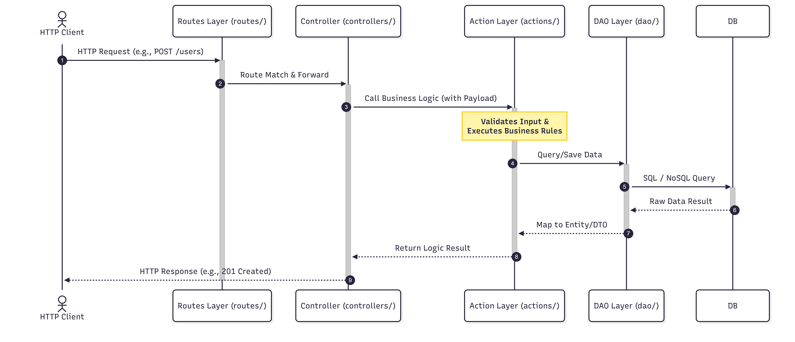
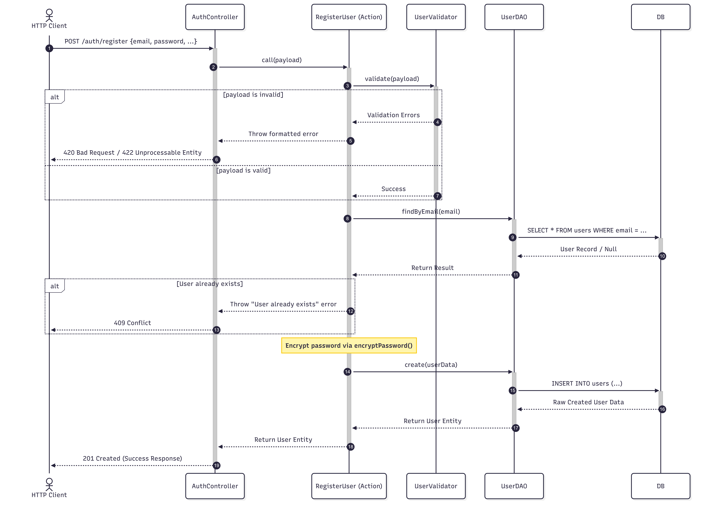

# Server Architecture

## Overview

The server follows a **layered architecture** pattern with clear separation of concerns. Each layer has a specific responsibility and communicates through well-defined interfaces.

## Architectural Flow

## Layer Descriptions

### 1. **Routes** (`src/routes/`)

- Entry point for HTTP requests
- Maps endpoints to controllers
- Handles middleware and error propagation
- Example: `POST /auth/register` → `AuthController.register()`

### 2. **Controllers** (`src/controllers/`)

- Accepts and validates HTTP request format
- Orchestrates the flow between routes and actions
- Handles response formatting
- Example: `AuthController` receives payload and calls `RegisterUser.call()`

### 3. **Actions** (`src/actions/`)

- Implements core business logic
- Performs validation using validators
- Coordinates between DAOs and entities
- Throws meaningful errors for invalid states
- Example: `RegisterUser` validates payload, checks for duplicate emails, encrypts password, and persists user

### 4. **DAOs (Data Access Objects)** (`src/dao/`)

- Manages all database operations (CRUD)
- Abstracts database implementation details
- Returns entity instances
- Example: `UserDAO.create()`, `UserDAO.findByEmail()`

### 5. **Entities** (`src/entities/`)

- Domain models representing core business concepts
- Contains business properties and behaviors
- Example: `User`, `AuthUser` classes

### 6. **Validators** (`src/utils/validators/`)

- Validates input payloads against defined schemas
- Uses Zod for schema validation
- Returns validation result with errors array or Zod error format

### 7. **Interfaces** (`src/interfaces/`)

- Type definitions and contracts
- Ensures consistency across layers
- Example: `IAction`, `IUserDAO`, `IValidator`

## Error Handling Flow

1. Validation errors caught in Actions
2. Meaningful error messages formatted as: `"Validation failed: error1, error2"`
3. Errors propagated through Controllers to Routes
4. Express middleware catches and sends HTTP response

## Data Flow Example: User Registration

## Key Design Principles

- **Separation of Concerns**: Each layer has a single responsibility
- **Dependency Injection**: Services are injected to enable testing and flexibility
- **Type Safety**: Interfaces ensure contract compliance across layers
- **Error Handling**: Meaningful error messages at validation boundaries
- **Testability**: Mocked dependencies allow isolated unit testing
